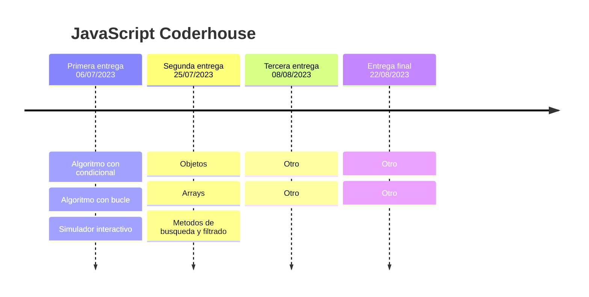

# Proyecto Final JavaScript Coderhouse

### 👉 Content
> Se creo una pagina interactiva con tematica de Rick y Morty.
> 
> Esta consta en consumir una API publica sobre la serie mencionada 
> 
>En proceso...

### 🛠 Built With

* 
* 
* 

##  📅 Roadmap

