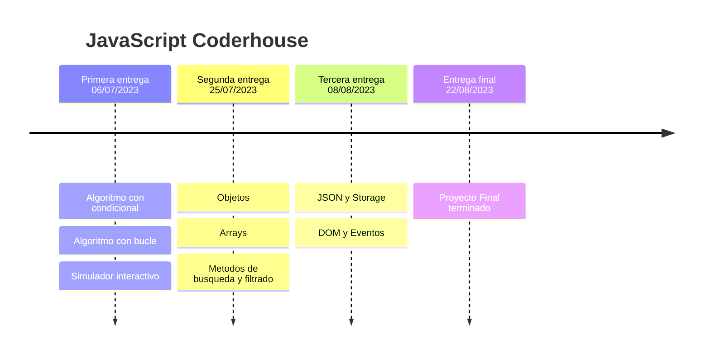

# Rick and Morty APP

### 👉 Content
> Se creo un sitio web interactivo con tematica de Rick y Morty.
> 
> Este sitio web llamado 'Rick and Morty APP' cuenta con las siguientes funcionalidades
> 
> Buscador de personajes:
> * Popup con mensaje de error en caso que no haya ingresado algun valor en el input.
> 
> * Popup con mensaje de error en caso que el personaje no exista.
> 
> * Redireccion a pagina con caracteristicas del personaje en caso de que este si exista.
>
> Contenedor de personajes:
> Al seleccionar el boton de 'Ver personajes' se direcciona a la pagina 'characters.html' la cual consume el siguiente endpoint de la API de Rick y Morty:
> * https://rickandmortyapi.com/api/character
>
> Esta cuenta con un paginado que divide 20 personajes por pagina con un total de 42 paginas totales.
>
> Filtrado de personajes:
> En la misma pagina donde se consume el endpoint de personajes esta la opcion de filtrar por algunas caracteristicas del personaje y en el contenedor de los mismos
> se mostrara la informacion segun los filtros seleccionados a la hora de hacer 'click' en el boton de 'Filtrar'
>
> Tambien, se desarrollo el boton de 'Remove filters' para eliminar los filtros y volver a obtener la lista completa de personajes
>
> Al presionar 'click' en un personaje se redirige a la pagina con las caracteristicas del mismo, funcionando de igual forma que a la hora de buscar un personaje con el buscador del 'index.html'.
>
> NO esta desarrollado el responsive.

### 🛠 Built With

* 
* 
* 

##  📅 Roadmap

